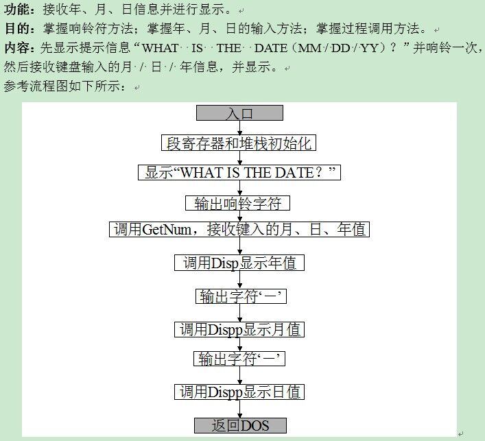
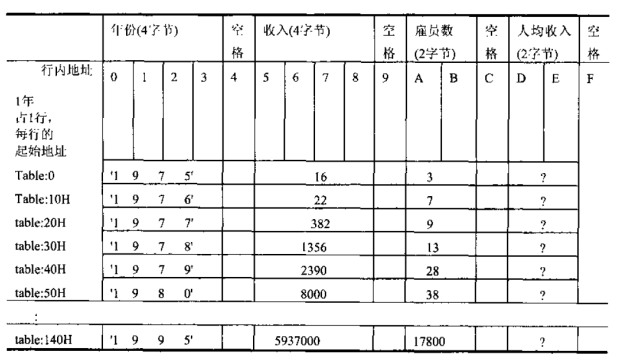
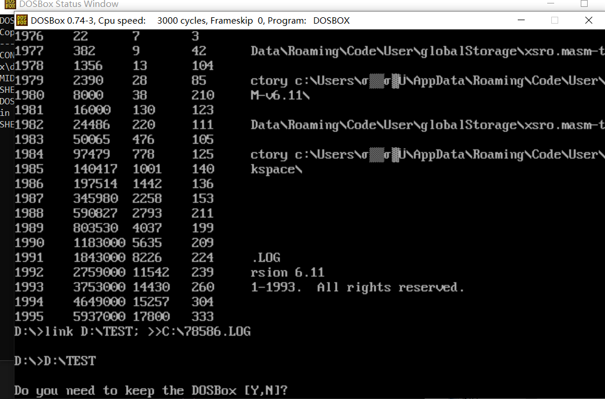

# Rademe_hw3

# 过程调用项目开发文档

项目源码地址：https://github.com/yyh2154064/Masm_8086.git

## 1.接受年月日信息并显示

### 1.1.项目要求



### 1.2.完成思路

根据项目要求构造过程函数：

```asm
;接受键入的月份、日期、年份
GetNum proc
;打印年份
Disp proc
;打印月份
Dispp proc
;打印日值
Disppp proc
```

### 1.3.开发中的问题

#### 1.3.1.关于输入数据的存储

我在编写输入的指令时，采取了int 01h号指令，这个指令每次只能接受一个字符的输入，并将输入保存在al寄存器中，我采用循环的方法进行连续六次不间断输入，并定义了三个数据段`Month`、`Day`、`Year`用于存储输入的数据，这样在每一次输出的时候，只需要访问数据段中的信息，即可进行输出。由于整个过程都是字符型数据的处理，故而没有数据转换的步骤。

#### 1.3.2.关于过程调用中的传参问题

过程调用中参数十分重要，由于8086 cpu的寄存器数目有限，在过程调用的过程中常常会伴有寄存器重用的问题，我在这里采用的方式为栈的使用，引入栈，将过程中可能会重用的寄存器原有的数据压栈，过程结束后再释放，这一思想在高级程序语言中相当于函数调用中形参不会改变实参。

而对于存在返回值的过程，在处理的时候对于相应寄存器在修改好值后不需要再从栈中读取数据的步骤，甚至在一开始就不用将该寄存器内的数据压栈。

### 1.4.心得体会

本项目较为简单，只涉及一般的过程调用，其中三个打印函数构造高度重合，也没有传入参数，无函数输出。但我通过这样一个项目，理解了过程调用的步骤，掌握了在调用过程中参数的传递过程，这为第二个项目的实现打下基础。


## 2.实验七——工资计算

### 2.1.项目要求

根据已给出的数据段，将相应数据经过计算后，存入table中，并将结果打印出来。**要求在实现的过程中使用不少于三个过程调用。**

其中，table表的布局如下：



### 2.2.完成思路

首先根据项目需求，确定所需的过程。

```asm
;将data段数据填入表table中
transmit proc 
;打印函数
Print proc
;进行不会产生溢出的除法运算
Divdw proc
;将16进制数转成10进制数的字符形式, 存放在str段中
Dtoc proc
;显示str段的内容
show_str proc
;将str段字符串初始化
str_ini proc
```

在最初拿到项目的时候，我发现这需要将之前所学全部融会贯通，除此之外，我认为本项目最难的点在于最终的表格打印。由于存储数据的不同，表格中不仅包括字符串，还有不同字节的整型，这就导致在输出的过程中，字符串可以直接输出，但整型的输出还要面临16进制转10进制的问题。和第一次作业的累加和输出不同，本次项目中公司的总收入超过了65535，即16位的寄存器无法处理这样大的数据，这导致了32位数据除10以及计算平均工资的过程中存在溢出的问题，这个问题我接下来将会具体讲解。

整个项目的完成思路如下：

- 数据段数据拷贝到table表
- 计算平均工资，并存储在table表
- 循环打印
  - 读取年份，调用show_str打印
  - 将总工资转化为10进制，调用函数打印
  - 员工数转化为10进制，调用函数打印
  - 平均工资转化为10进制，调用函数打印

### 2.3.开发中的问题

#### 2.3.1.数据段拷贝过程

由于数据段、table表个需要一个段基址，这里采用了ds存数据段，es存table表段的方式，在进行数据的拷贝过程中，我注意到段内偏移量较为复杂，这里采用了`ds:[bx+si+立即数]`方式寻址，在整个拷贝的循环过程中共存在四个变量：

- bp    ;用于table表寻址，每次循环自增16
- si     ;用于数据中summ寻址，每次循环自增4
- di     ;用于数据中ne寻址，每次循环自增2
- cx,21

由于数据段的结构和table表不同，所以在每一次填表的过程中，都需要跳着在数据段中寻址，这里需要记住年份起始地址为：data:0 ；收入起始地址为：data:84 ；雇员起始地址为：data:168

#### 2.3.2.对于32为被除数除法过程数据溢出的问题

由于公司总收入超过寄存器最大存储范围，所以在除法进行的过程中需要避免溢出。我在王爽的教材中找到了处理这类问题的方法，总结下来就是一个公式：
$$
int(dx / cx) * 65536 + [rem(dx / cx) * 65536 + ax]
$$
其中，ax存储被除数的低16位，dx存储被除数的高16位，cx存储除数

#### 2.3.3.老生常谈问题——进制转换输出

这次的进制转换比上次困难一些，因为需要对32位数据进行处理，但由于事先实现了除法溢出的问题，所以相关的除法运算可以直接调用函数来解决。需要注意的是，我事先并不知道共有多少位数据，因此在进制转换的过程中，需要进行循环，循环的终止条件是商为0，此时可以判定短除结束，接下来就是转化为字符型进行输出了。

#### 2.3.4.打印输出的手段

这里我借鉴了CSDN上的方法，自己定义了一个函数，名为show_str，作用是将str中间栈的内容打印到屏幕上。但是这样的问题是我打印的时候需要自主定位打印开始的行、列。而且在c中有一个cls()清屏的函数，我目前还不知道8086中清屏的指令是什么，因此我的输出结果是覆盖式的，也就是说从左上角开始显示表格，但是在表格外的地方，如果原来有输出则输出依然在，如下图所示：



这是我在vscode中运行的结果。

### 2.4.心得体会

这个项目的难度有点超出我的想象。我在此前并没有接触过涉及知识面十分广泛的综合性项目，这也直接导致了我在最开始并不知道怎么下手，而且在debug的过程中花费了很长的时间。汇编的学习是一个循序渐进的过程，我在这次的项目中几乎复用了我之前写过的全部代码，而且有很多过程函数是在王爽教材中的练习题，为了完成这个项目我需要将教材的练习题也做掉，所幸结果是好的。

经过了这种大规模的打印输出，我对每一种数据的存储、转化过程了如指掌，我知道了32位数据如何处理，了解了怎样避免数据溢出，实现了两种截然不同的表格间的数据拷贝，完全靠循环的方式。不得不说，虽然8086仅仅只有很少的寄存器可以使用，但由于栈的存在，这些寄存器几乎可以完成所有想要完成的事（只是过程比较辛酸）。

汇编语言对我理解计算机底层硬件的工作逻辑还是很有帮助的，它帮我将以前仅存在于理论的抽象知识具体化，也让我真正意识到计算机工作时繁杂的指令皆有条理，都有来源。

愿与诸君共勉。
